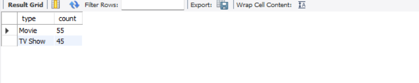
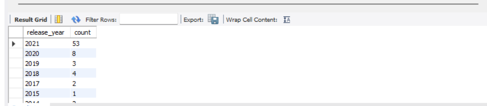

## WEEK 8

### Briefly explain any difficulties and 1 interesting thing you noticed about your chosen dataset in your readme section of your GitHub repo.
 - Quite straightforward to import data to SQL.
 - Each Record is uniquely identified by a show_id which is the primary key

### Use simple SQL queries to play with the data.
`SELECT * FROM week8.netflix_titles;` - displays all the data 

### Find 2 cool facts hidden within the data (e.g., most popular interests).

- Movies are pouplar than Tv Shows 
- 
SELECT type, COUNT(*) as count
FROM week8.netflix_titles
GROUP BY type
ORDER BY count DESC; 



### Formulate 2 questions about the data (e.g., what are popular shows in different countries?).
- Popular shows in different countries?
  - In Japan and USA the most popular shows are action and adventure while in India its internatonal Tv Shows and Romantic shows.

``` 
{ 
SELECT country, listed_in, COUNT(*) as count
FROM netflix_titles
GROUP BY country, listed_in
ORDER BY count DESC; 
}
```
- Year with most releases?
 - 2021 happens to be the year with the most releases.


